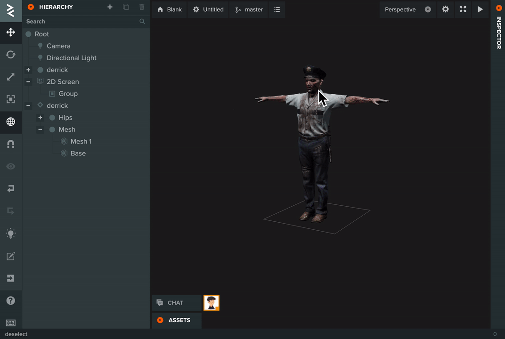
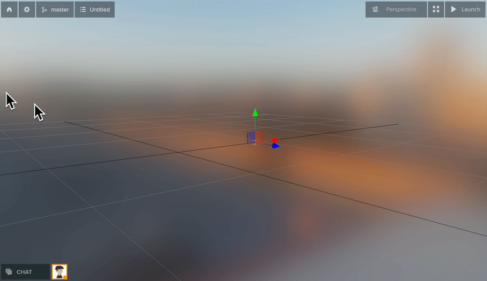
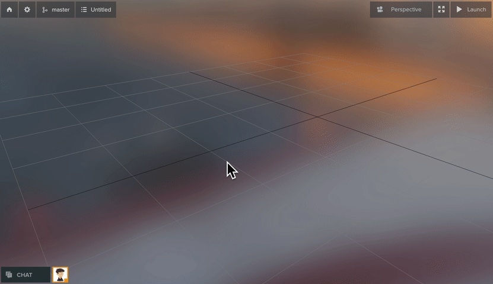

# yaustar PlayCanvas Editor Tools

## Introduction
These scripts are made to make working with the Editor a bit easier and uses elements of the [PlayCanvas Editor API][editor-api-github] for extra functionality.

This process may be replaced when PlayCanvas adds support for Editor scripting directly in the Editor itself.

Assuming you are using Chrome:

1. Install Violent Monkey Chrome extension: https://violentmonkey.github.io/
2. Open the URLs to install the script:
    - https://yaustar.github.io/playcanvas-editor-api-tools/editor-utils.user.js
    - https://yaustar.github.io/playcanvas-editor-api-tools/code-editor-utils.user.js
    - https://yaustar.github.io/playcanvas-editor-api-tools/launch-tab-utils.user.js
    - https://yaustar.github.io/playcanvas-editor-api-tools/project-skybox.user.js (requires editor-utils.user.js to be installed)
3. Done!

## Tools

### In Editor

A right click context menu in the 3D viewport


#### Hierarchy Menu

A context menu in the 3D viewport to make it easier to select entities in the viewport, especially if the render mesh is a child of the entity that has the physics collision and/or logic.

Right clicking on the viewport when one entity is selected will give a list of the selected entity parents. Clicking on any of these entries will select that entity.



#### Load GLB for selected Entity

This loads the GLB model for the current selected Entity to allow you to see it at Editor time. 

It doesn't add it to hierarchy in the Editor and therefore, you can't select it, modify it etc.

Explicitly designed to be used with the scripts in the [Load GLB project example](https://developer.playcanvas.com/en/tutorials/loading-gltf-glbs/).



#### Load all GLBs in the scene

Same restrictions as 'Load GLB for selected Entity' but does it for all the Entities in the scene. Warning: Can be slow on large scenes as it has to go through every Entity.



#### Projected Skybox

Requires `editor-utils.user.js` to be installed.

This is an additional script to be used with the following project: https://playcanvas.com/project/985028/overview/projective-skybox

The project projects the skybox onto geometry creating a more 'grounded' and realistic look to the scene via a custom shader.


### Launch Tab

#### Animation asset data report
```
pcCmdTools.animationAssetReport(pc.Application.getApplication().assets.find('nameOfAsset.glb', 'animation'));
```

**Incomplete**: Does not support cubic curves.

With the devtools open, a report of the animation timeline keyframes and transformation data can be printed out to console.

This will show the node hierarchy path, the type of transformation, keyframe time and data.

Example output:


[editor-api-github]: https://github.com/playcanvas/editor-api

### Code Editor (Monaco)

#### Minimap Toggle

Open the Command Palette and search for 'Toggle Minimap'.

#### Theme

Currently using Dracula (personal favourite theme) from https://github.com/brijeshb42/monaco-themes/tree/master/themes
